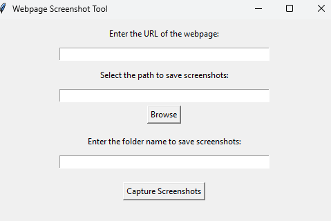

# 📸 Webpage Screenshot Tool

Welcome to my project repository! 🚀
1️⃣ A **Webpage Screenshot Tool** for taking full-page screenshots of websites.

---

## 🌟 Features

### **📸 Webpage Screenshot Tool**

- 🌐 Capture full-page screenshots of any webpage.
- 📂 Save screenshots in a custom folder with your desired name.
- 🎵 Play a welcome sound upon completion for a delightful user experience.

---

## 🖼️ 📸 Screenshot



---

## 🛠️ Setup Instructions

### Prerequisites

- Python 3.7+ 🐍
- Required libraries: `tkinter`, `selenium`, `Pillow`, `gtts`, `playsound`

### Installation Steps

1. Clone the repository:
   
   ```bash
   git clone https://github.com/SangeetaSharma73/ScreenshotApp.git

   ```

2. Install dependencies:

`pip install -r requirements.txt`

3. Download a ChromeDriver compatible with your browser version for the screenshot tool.

4. Run the applications:

- Webpage Screenshot Tool:
  `python GuiScreenshot.py`

## 🎉 How to Play & Use

### 📸 Webpage Screenshot Tool

1. Enter the webpage URL.
2. Select the save folder and provide a name.
3. Click "Capture Screenshots" and let the magic happen! ✨

## 📢 Contributions Welcome!

Got a cool idea or improvement? 🌟 Feel free to fork this repository and create a pull request. Contributions are highly appreciated! 💡

## 📝 License

This project is licensed under the MIT License.

🙌 Thank You for Visiting!
⭐ Don't forget to star this repository if you found it helpful or fun!

Happy Coding!😊💻✨
